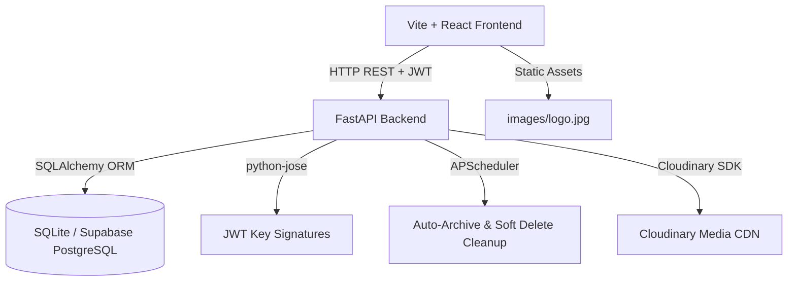

# The Round Table - Developer & API Documentation

Welcome! This documentation is designed for any future developer working on the **The Round Table (Kirori Mal College)** college society portal. It explains the system architecture, authentication flow, database design, background services, API endpoints, and debugging techniques.

---

## 🏗️ 1. System Architecture Overview

The platform uses a decoupled, full-stack architecture built for high performance, ease of hosting, and rich visual aesthetics:



### Stack Components
1. **Frontend**: React.js (Vite compiler) styled with Bootstrap 5 and custom HSL/glassmorphism parameters. Uses **Axios** for API requests and **Framer Motion** for premium interactive animations.
2. **Backend**: Python **FastAPI** providing high-speed asynchronous endpoint handlers, auto-documenting Swagger/OpenAPI endpoints, and robust schema validation via **Pydantic**.
3. **Database Layer**: **SQLAlchemy ORM** connecting to **Supabase PostgreSQL** in production. Features an automatic try-except wrapper that falls back to local **SQLite** (`college_society.db`) if network or password issues prevent connecting to Supabase, guaranteeing continuous development.
4. **Media CDN**: **Cloudinary** SDK used for uploading, compressing, and deleting user-uploaded PDF papers, image banners, and gallery photos.

---

## 🔐 2. Authentication & Role-Based Access Control (RBAC)

Security is managed via native `bcrypt` password hashing and stateful JWT (JSON Web Tokens) with a built-in token rotation pipeline.

```mermaid
sequenceDiagram
    participant User
    participant React as React Frontend
    participant API as FastAPI Backend
    
    User->>React: Enters Email & Password
    React->>API: POST /api/auth/login (urlencoded)
    API->>API: bcrypt.checkpw(plain, hashed)
    API->>React: Returns Access + Refresh Token
    React->>React: Saves tokens in LocalStorage
    Note over React,API: Next requests automatically attach token: Authorization: Bearer <Access>
    
    rect rgb(30, 41, 59)
        Note over React,API: If Access Token expires (401 error code)
        React->>API: POST /api/auth/refresh (send refresh token)
        API->>React: Returns New Access + Refresh Token
    end
```



### RBAC Security Scopes
We seed 5 distinct roles in the database, mapped via a `role_id` column in the `users` table:
1. **Super Admin**: Has unrestricted scopes (`{"manage_journals": true, "manage_events": true, "manage_gallery": true, "manage_users": true, "view_logs": true, "delete_logs": true}`).
2. **Content Admin**: Can manage journals, events, and notices, but cannot manage users or purge logs.
3. **Gallery Admin**: Dedicated access to upload, categorize, and archive media items.
4. **Moderator**: Access to read pending academic submissions and approve/reject with feedback comments.
5. **User**: Standard students who can register, edit their own profile, and submit journals to track their review timeline.

---

## 🛠️ 3. Key Core Workflows

### A. Soft-Delete & Recycle Bin Purging
To prevent accidental data loss, all standard delete operations on content tables (Journals, Events, Gallery, Resources) are soft-deleted:
1. The deletion endpoint sets `is_deleted = True` and `deleted_at = datetime.utcnow()`.
2. The item immediately disappears from the public portal and main admin boards.
3. The item remains viewable under the **Recycle Bin** tab in the Admin Console.
4. **Permanent Purging**:
   - *Manual*: A Super Admin can click **Purge**, which deletes the database record and contacts Cloudinary to purge the raw file.
   - *Automated*: A background task runs every 24 hours. Any item with `is_deleted == True` and `deleted_at` older than 15 days is permanently hard-deleted.

### B. Auto-Archive Pipeline
1. The table `archive_settings` contains active limits (in days) for content categories: `journals` (default: 180), `events` (default: 30), `gallery` (default: 365), and `news` (default: 180).
2. A background scheduler runs every hour, comparing item ages:
   - *Journals/Gallery/News*: If `created_at < now - duration_days`, sets `is_archived = True`.
   - *Events*: If `date < now` (concluded) or `created_at < now - duration_days`, sets `is_archived = True`.
3. Archived items disappear from public list pages but remain visible in the Admin Console under their respective categories marked with an "Archived" indicator.

---

## 🌐 4. Complete REST API Specifications

All endpoints are prefixed with `/api`. Standard parameters require a bearer token under `Authorization: Bearer <token>` header unless specified as Public.

### Authentication Endpoints (`/api/auth`)
* `POST /api/auth/register` (Public): Registers a new standard user. Returns Pydantic `UserResponse`.
* `POST /api/auth/login` (Public, urlencoded): Accepts `username` (email) and `password`. Returns JWT `Token` (access, refresh, role, and name).
* `POST /api/auth/refresh` (Public): Takes `{refresh_token}` in JSON body and returns a new Access + Refresh token pair.
* `GET /api/auth/profile`: Returns the active user's details and role permissions.

### User Administrative Controls (`/api/users`)
* `GET /api/users` (Super Admin only): Returns a list of all registered users.
* `GET /api/users/roles` (Super Admin only): Returns all role names and permission JSON structures.
* `POST /api/users/admin-create?role_id={id}` (Super Admin only): Directly seeds an admin/moderator user with a pre-assigned role.
* `PUT /api/users/{user_id}` (Super Admin only): Modifies a user's full name, role ID, or toggles their active status (`is_active` parameter can lock/unlock accounts).

### Journals Workflow (`/api/journals`)
* `GET /api/journals` (Public): Returns all approved, non-archived, non-deleted journals. Supports query parameters `search`, `category`, and `tag`.
* `GET /api/journals/detail/{journal_id}` (Public): Returns details of a specific journal.
* `POST /api/journals/submit` (Registered User Form-Data): Takes `title`, `abstract`, `category`, `tags` form strings and a `file` (restricts to PDF). Uploads to Cloudinary raw folders and logs a pending draft.
* `GET /api/journals/my-submissions` (Registered User): Returns all submission drafts and evaluation history timelines for the active user.
* `GET /api/journals/admin/all` (Content Admin/Moderator): Returns all non-deleted journals (including pending, approved, and rejected drafts).
* `PUT /api/journals/moderate/{journal_id}` (Content Admin/Moderator): Takes `{status: "Approved" | "Rejected", moderator_comment: "string"}`. Updates status and logs the audit reason.
* `PUT /api/journals/archive/{journal_id}` (Content Admin): Toggles `is_archived` status manually.
* `DELETE /api/journals/{journal_id}` (Content Admin): Soft-deletes a journal, moving it to the recycle bin.

### Events Manager (`/api/events`)
* `GET /api/events` (Public): Lists events. Supports query parameters `is_mun` (boolean) and `include_past` (boolean).
* `POST /api/events` (Content Admin Form-Data): Uploads banner image to Cloudinary and schedules a new event.
* `PUT /api/events/{event_id}` (Content Admin Form-Data): Updates title, description, banner file, location, or toggles `is_mun`.
* `DELETE /api/events/{event_id}` (Content Admin): Soft-deletes the event.

### Photo Gallery (`/api/gallery`)
* `GET /api/gallery` (Public): Returns images. Supports query parameter `category` (General, Debating, Literary, MUN).
* `POST /api/gallery` (Gallery Admin Form-Data): Uploads a photo to Cloudinary and registers it.
* `PUT /api/gallery/{item_id}` (Gallery Admin Form-Data): Updates metadata (title, category).
* `DELETE /api/gallery/{item_id}` (Gallery Admin): Soft-deletes the image asset.

### Announcements & Bulletins (`/api/resources`)
* `GET /api/resources` (Public): Lists notice files. Filters by `type` (News, Resource) or `category` (General, MUN RoP, MUN Country Guide).
* `POST /api/resources` (Content Admin Form-Data): Uploads announcement files (PDF country guides/templates) and creates a notice.
* `PUT /api/resources/{resource_id}` (Content Admin Form-Data): Modifies the notice.
* `DELETE /api/resources/{resource_id}` (Content Admin): Soft-deletes the bulletin.

### Action Logs Dashboard (`/api/logs`)
* `GET /api/logs` (Super Admin only): Returns logs with query parameters `search` (email/details keyword) and `action` (action name).
* `DELETE /api/logs/{log_id}` (Super Admin only): Deletes a single log line. Records a permanent `DELETE_LOG` meta-log entry.
* `POST /api/logs/purge?days=30` (Super Admin only): Purges all logs older than 30 days.

### Recycle Bin & System Adjusters (`/api/admin`)
* `GET /api/admin/recycle-bin` (Content Admin/Super Admin): Lists all soft-deleted records categorised by table arrays (`journals`, `events`, `gallery`, `resources`).
* `PUT /api/admin/recycle-bin/restore/{item_type}/{item_id}` (Content Admin): Reactivates a soft-deleted item.
* `DELETE /api/admin/recycle-bin/purge/{item_type}/{item_id}` (Super Admin only): Permanently purges database records and Cloudinary file links.
* `GET /api/admin/archive-settings` (Content Admin): Returns all archive durations rules.
* `PUT /api/admin/archive-settings/{setting_id}` (Super Admin only): Modifies duration age limits.

---

## 🐞 5. Developer Debugging & Troubleshooting Guide

### A. Testing API Changes
Backend compilation is verified using `pytest`. Always run tests after editing models or schemas:
```bash
# From the backend directory
$env:PYTHONPATH="."
.\venv\Scripts\pytest
```

### B. Accessing the SQLite Database File
If the backend is running in local fallback mode, database tables are stored in `backend/college_society.db`. You can use any SQLite browser (e.g. **DB Browser for SQLite** or VS Code SQLite Viewer extension) to inspect and edit the tables.

### C. Modifying Seeding Parameters
If you want to change the default admin email or password seeded on startup, edit the credentials in `backend/.env`:
```env
ADMIN_INITIAL_EMAIL=your-new-admin@society.edu
ADMIN_INITIAL_PASSWORD=NewSuperSecurePass!
```
*Note: If the DB is already seeded, the startup task will not overwrite the existing admin. You can run `python scratch_check_db.py` to forcefully reset the credentials in the database to match the new values!*

### E. Modifying the Scheduler Interval
If you want to speed up the background cleanups or archives checking for testing purposes, modify the trigger intervals in `backend/app/main.py`:
```python
# Change interval from hours to seconds for instant test triggers
scheduler.add_job(archive_stale_content, 'interval', seconds=10, id='archive_job')
scheduler.add_job(purge_recycle_bin, 'interval', seconds=15, id='purge_job')
```
